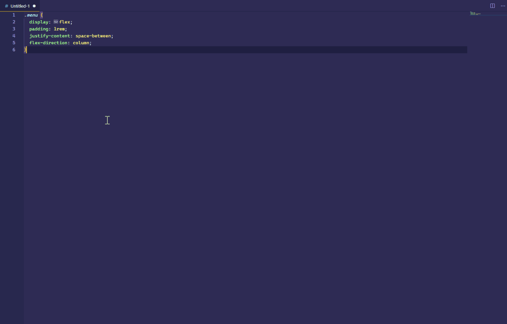
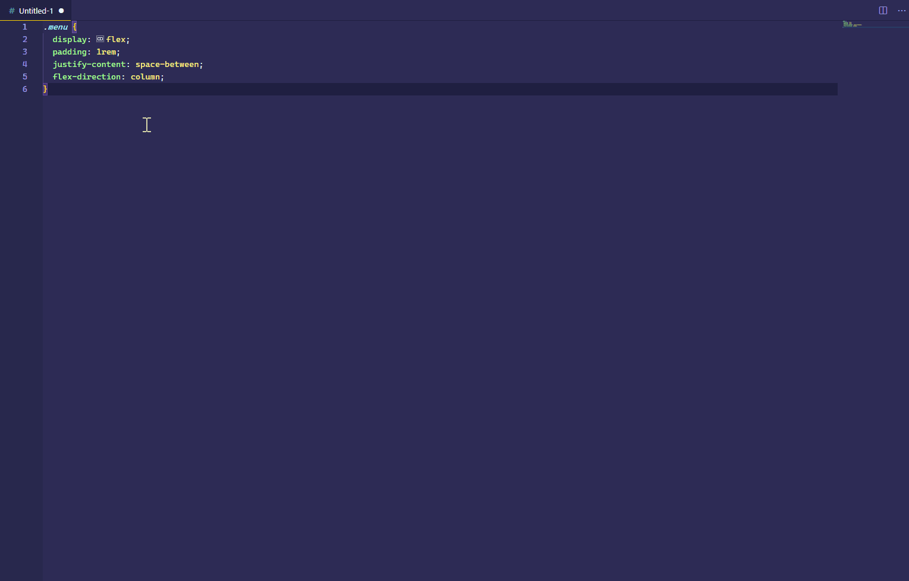
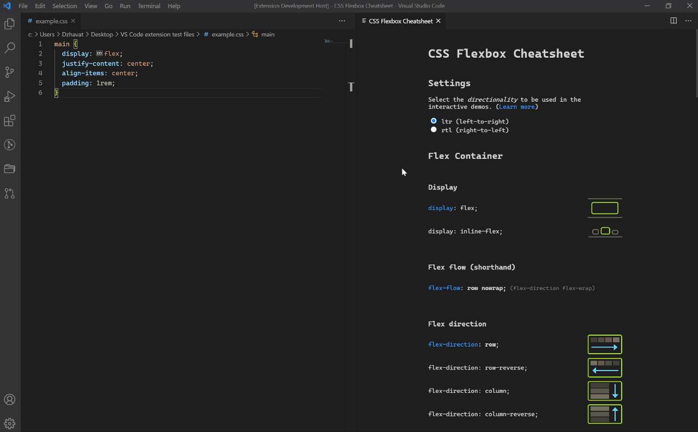
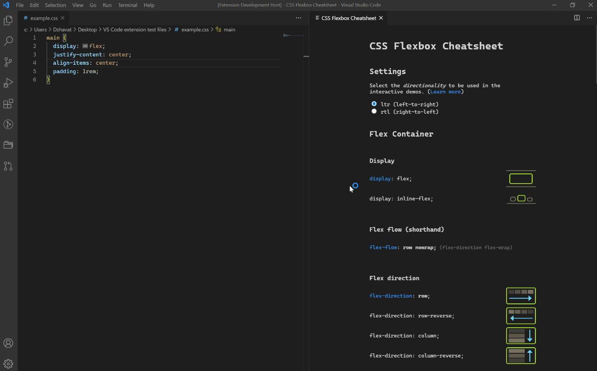
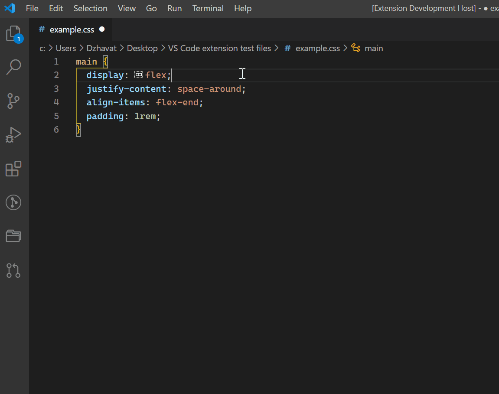

# CSS Flexbox Cheatsheet ([link](https://marketplace.visualstudio.com/items?itemName=dzhavat.css-flexbox-cheatsheet))

VS Code extension that lets you open a flexbox cheatsheet directly in the editor.

## Features

The cheatsheet can be opened in a few ways:

- Press `Ctrl + Shift + P` (Win, Linux) / `Cmd + Shift + P` (Mac) and search for the `Open CSS Flexbox Cheatsheet` command.
- Press `Ctrl + K K` (Win, Linux) / `Cmd + K K` (Mac) keyboard shortcut.
- Hover any `display: flex` declaration and click the `Open CSS Flexbox Cheatsheet` link in the popup.

Besides the `Open CSS Flexbox Cheatsheet` link in the hover popup, there’s also an image shown for each flexbox property. This aims to make it easier to understand how each property works without opening the cheatsheet. This is available for the following file types:

- CSS
- Less
- Sass
- Scss

Most properties also have interactive playgrounds that are part of the cheatsheet.

## Settings

After opening the cheatsheet, you can select the directionality to be used in the interactive playgrounds. This is especially useful for languages that write from right-to-left (e.g. Arabic). [Learn more](https://developer.mozilla.org/en-US/docs/Web/HTML/Global_attributes/dir).

## Font and colors

The colors of the cheatsheet automatically adapt to the selected theme. The font is based on the user’s preferred font.

## Support my work

If you find this extension useful and would like to support my work, you can [buy me a cup of tea](https://www.buymeacoffee.com/dzhavat). Thank you!

## Demo

#### Using the `Open CSS Flexbox Cheatsheet` command

#### Clicking the `Open CSS Flexbox Cheatsheet` link on hover

#### Trying the interactive playgrounds

#### Changing directionality in the interactive playgrounds

#### Showing an image on hover

## Credit

The cheatsheet in this extension is based on the excellent [Flexbox Cheatsheet](https://darekkay.com/dev/flexbox-cheatsheet.html) by [Darek Kay](https://darekkay.com/).
