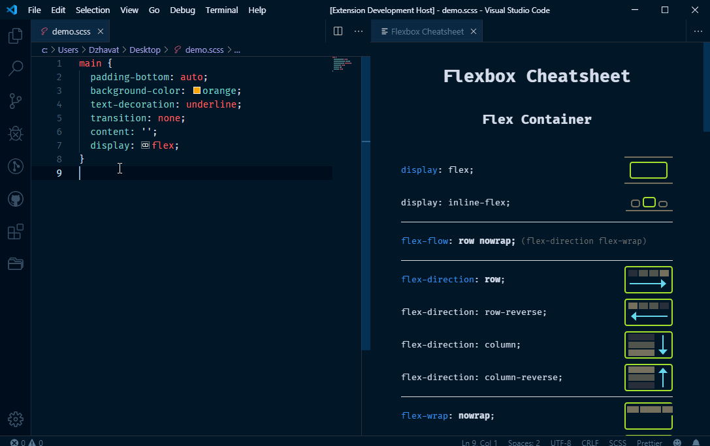

# CSS Flexbox Cheatsheet ([link](https://marketplace.visualstudio.com/items?itemName=dzhavat.css-flexbox-cheatsheet))

VS Code extension that lets you open a flexbox cheatsheet directly in the editor.

## Features

The cheatsheet can be opened in two ways: 

* By pressing `Ctrl+Shift+P` (Win) / `Cmd+Shift+P` (Mac) and searching for the `Open Flexbox Cheatsheet` command.
* Hovering any `display: flex` declaration and clicking the `Open Flexbox Cheatsheet` link in the popup.

Works with the following file types:

* CSS
* Less
* Sass
* Scss

## Demo

#### Using the `Open Flexbox Cheatsheet` command

#### Clicking the `Open Flexbox Cheatsheet` link on hover

#### Changing themes

## Credit

The cheatsheet in this extension is based on the excellent [Flexbox Cheatsheet](https://darekkay.com/dev/flexbox-cheatsheet.html) by [Darek Kay](https://darekkay.com/).
