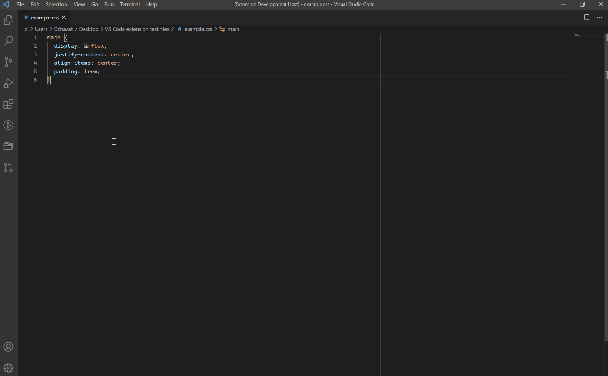

# CSS Flexbox Cheatsheet ([link](https://marketplace.visualstudio.com/items?itemName=dzhavat.css-flexbox-cheatsheet))

VS Code extension that lets you open a flexbox cheatsheet directly in the editor.

## Features

The cheatsheet can be opened in two ways:

* Press `Ctrl+Shift+P` (Win, Linux) / `Cmd+Shift+P` (Mac) and search for the `Open Flexbox Cheatsheet` command.
* Hover any `display: flex` declaration and click the `Open Flexbox Cheatsheet` link in the popup.

Besides the `Open Flexbox Cheatsheet` link in the hover popup, there’s also an image shown for each flexbox property. This aims to make it easier to understand how each property works without opening the cheatsheet.

Works with the following file types:

* CSS
* Less
* Sass
* Scss

The colors of the cheatsheet automatically adapt to the selected theme. The font is based on the user’s preferred font family.

## Demo

#### Using the `Open Flexbox Cheatsheet` command

#### Clicking the `Open Flexbox Cheatsheet` link on hover

#### Showing an image on hover

#### Changing themes

## Credit

The cheatsheet in this extension is based on the excellent [Flexbox Cheatsheet](https://darekkay.com/dev/flexbox-cheatsheet.html) by [Darek Kay](https://darekkay.com/).
